# 慢记工具 - 全平台记忆训练工具

## 软件简介

**慢记工具**是一款基于**艾宾浩斯遗忘曲线**开发的智能记忆训练工具。不局限于背单词，更支持听写练习、数字记忆、文本/诗词背诵、记忆宫殿（轨迹法）、知识库（内置题包）、快捷键记忆、音标学习、字母映射等多元记忆场景。支持 uTools 插件、Electron 桌面应用、Web 浏览器、微信小程序、Android/iOS App 五大平台，学习进度可在多端之间同步。

### 核心特点

- **科学记忆算法**：基于艾宾浩斯遗忘曲线，自动安排复习计划，14 个等级间隔科学递进
- **单词学习**：支持输入、划词、划段、截图（OCR）等多种添加方式，内置 CET-4/6、考研、托福、雅思等英语词库与 JLPT N5 日语词库，支持单词筛选、切换词库、词根词缀高亮
- **多语言学习**：同一套应用支持英语、日语、俄语、西班牙语、法语——语言按词库设置，翻译、发音（TTS）、听写、拼写、截图 OCR 全链路跟随当前词库语言；非英语 Tesseract OCR 语言包首次使用时按需下载
- **听写与拼写**：播放发音进行听写与拼写练习，检验听力与拼写能力，进度自动保存
- **多引擎翻译**：支持有道、百度、阿里、腾讯、DeepSeek、Kimi、通义千问、智谱 GLM、MiniMax、腾讯混元、uTools AI、Ollama 本地模型等十余种翻译引擎
- **离线使用**：支持本地词典，无网络也能正常使用
- **专注模式**：迷你悬浮窗（间隙学习不打扰），支持置顶、贴边、锁定、透明度调节、字体颜色、字号、背景图片自定义
- **数字记忆**：通过图像关联法（数字编码）高效记忆长串数字，支持一键导入预设编码、映射表导出打印、自定义条目与训练考核
- **文本记忆**：长篇文本、诗词、知识点的分段记忆与背诵练习，支持时间线整理、地理关联、打字/填空/关键词练习、悬浮滚动播放、心得笔记
- **记忆宫殿**：基于轨迹法（位置记忆法），内置 8 套桩库一键导入生成桩位，支持桩图配图、批量解绑与按桩回忆
- **知识库**：36 个内置知识包（乘法表/元素周期表/高等数学/理化公式/朝代/节气/生肖等），翻卡、反向、四选一、输入、顺序回忆五种练习模式，公式条目支持函数图像与现象动画
- **快捷键记忆**：双拼、五笔、数字小键盘、系统/开发软件快捷键练习，支持分类筛选与双拼键位显示
- **音标学习与字母映射**：音标辨音、音素拆解等训练（数据集随当前语言切换：英语音标/日语五十音/俄语西里尔字母等），字母-图片映射联想记忆（各语言字母表）
- **记忆测试**：词汇量预测与记忆效果检验
- **数据安全**：本地数据库存储，支持导入导出；多端同步覆盖单词、文本、数字、快捷键、音标、知识库等学习进度
- **全平台覆盖**：uTools / Electron / Web / 微信小程序 / Android / iOS

---

## 目录

1. [安装与启动](#安装与启动)
2. [功能入口](#功能入口)
3. [添加单词](#添加单词)
4. [单词复习](#单词复习)
5. [听写模式](#听写模式)
6. [专注模式](#专注模式)
7. [音标学习](#音标学习)
8. [字母映射记忆](#字母映射记忆)
9. [数字记忆训练](#数字记忆训练)
10. [文本记忆](#文本记忆)
11. [记忆宫殿](#记忆宫殿)
12. [知识库](#知识库)
13. [快捷键记忆](#快捷键记忆)
14. [记忆测试](#记忆测试)
15. [快速翻译](#快速翻译)
16. [词库管理](#词库管理)
17. [设置与配置](#设置与配置)
18. [导入与导出](#导入与导出)
19. [多端同步](#多端同步)
20. [快捷键](#快捷键)
21. [常见问题](#常见问题)

---

## 平台支持

| 平台 | 技术方案 | 状态 | 构建命令 |
|------|---------|------|----------|
| uTools 插件 | Vue3 + Vite | ✅ 可用 | `npm run build` |
| Electron 桌面版 | Electron + Vue3 | ✅ 可用 | `npm run build:electron` |
| Web 版 | Vue3 + Vite | ✅ 可用 | `npm run build:web` |
| 微信小程序 | UniApp + Vue3 | ✅ 可用 | `npm run build:mp-weixin` |
| Android App | UniApp + Vue3 | ✅ 可用 | `npm run build:app-android` |
| iOS App | UniApp + Vue3 | ✅ 可用 | `npm run build:app-ios` |

## 安装与启动

### 环境要求

- **Node.js** >= 18
- **uTools** 软件（Windows / macOS / Linux）- 用于 uTools 插件版本

### 安装依赖

```bash
npm install
```

### 各平台构建

```bash
# uTools 插件
npm run build

# Electron 桌面版
npm run build:electron
npm run pack:electron

# Web 版
npm run build:web

# 微信小程序
cd mobile && npm install
npm run build:mp-weixin

# Android App
npm run build:app-android

# iOS App
npm run build:app-ios
```

### uTools 插件安装

1. 下载并安装 [uTools](https://u.tools/)
2. 在 uTools 插件市场搜索"慢记工具"或"慢记单词本"
3. 点击安装插件
4. 安装完成后，按 `Alt + 空格` 呼出 uTools，输入 `慢记` 或 `mj` 即可使用

---

## 功能入口

在 uTools 搜索框输入以下关键字，快速进入对应功能：

| 关键字 | 功能说明 |
|--------|----------|
| `mj` / `慢记` / `review` | 进入单词列表（复习模式） |
| `over` | 添加单词（需输入内容后触发） |
| `hc` / `划词添加` | 划词添加单词 |
| `划段添加` | 划段添加（添加整个段落） |
| `截图添加` / `ss` | 截图 OCR 识别后添加 |
| `翻译` / `fy` | 快速翻译 |
| `数字记忆` | 进入数字记忆训练 |
| `记忆测试` | 进入记忆力测试 |
| `文本记忆` / `诗词记忆` / `wbjy` | 进入文本记忆模式 |
| `快捷键记忆` | 进入快捷键记忆模式 |

> 部分模块不在侧边栏中，需从其他页面进入：记忆宫殿、知识库在**文本记忆页**顶部的视图切换标签中（数字记忆页也有知识表面板）；音标学习、字母映射在**单词页**底部工具栏的图标按钮进入（uTools 插件、Electron 桌面版、Web 版均支持）。

---

## 添加单词


### 1. 输入添加

1. 呼出 uTools，输入任意单词（如 `apple`）
2. 选择"**加入单词簿**"
3. 系统自动翻译并弹出翻译结果
4. 点击确认即可加入学习列表

### 2. 划词添加

1. 选中任意文本（单词或短语）
2. 呼出 uTools，输入 `划词添加` 或 `hc`
3. 选择翻译引擎，确认后自动添加

### 3. 划段添加

1. 选中一段文字
2. 呼出 uTools，输入 `划段添加`
3. 系统会将段落自动拆分为单词并加入学习列表


### 4. 截图添加

1. 呼出 uTools，输入 `截图添加` 或 `ss`
2. 截取包含文字的图片区域
3. 系统自动 OCR 识别图片中的文字
4. 选择需要添加的单词，确认后添加


> **注意**：截图翻译每日限制 5-10 次（未配置个人密钥时）。配置自己的密钥后可无限使用。

---

## 单词复习

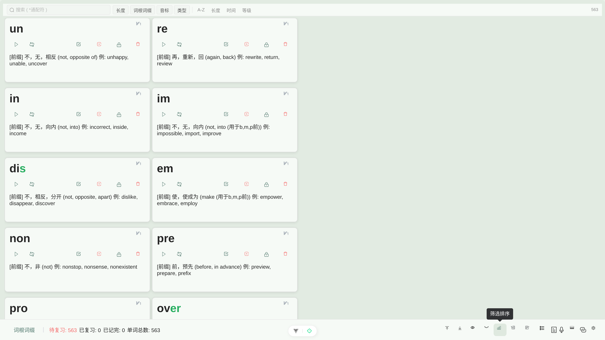

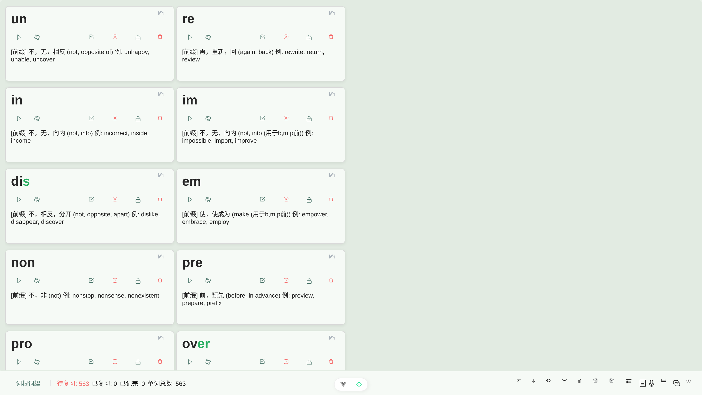

### 进入复习模式

呼出 uTools，输入 `mj`、`慢记` 或 `review`，进入单词列表界面。

### 复习界面说明

| 区域 | 说明 |
|------|------|
| **单词卡片** | 显示单词、音标（词根词缀颜色区分）、发音按钮、等级标签 |
| **释义区** | 显示中文释义与例词，可编辑 |
| **操作按钮** | 播放 / 翻译 / 认识 / 忘记 / 已记完 / 删除 |
| **筛选排序** | 支持通配符搜索、长度、词根词缀、音标、类型筛选与 A-Z/长度/时间/等级排序 |
| **词库切换** | 左下角点击当前词库名，支持多词库切换学习 |

### 复习操作

| 操作 | 说明 | 快捷键 |
|------|------|--------|
| **播放发音** | 点击喇叭图标播放美式发音 | `Shift + P` |
| **翻译** | 查看单词翻译释义 | `Shift + T` |
| **认识** | 标记为已掌握，升级复习等级 | `Shift + R` |
| **忘记** | 标记为忘记，降低复习等级 | `Shift + F` |
| **已记完** | 锁定标记，该单词不再出现在待复习列表 | 卡片锁形按钮 |
| **删除** | 从当前词库移除该单词 | 卡片删除按钮 |
| **保存释义编辑** | 编辑释义后保存 | `Ctrl + Enter` |

### 记忆等级说明

单词共有 **14 个等级**，每次有效复习会提升等级，延长下次复习时间：

| 等级 | 复习间隔 | 说明 |
|------|----------|------|
| 1 | 1 分钟 | 第一次复习 |
| 2 | 5 分钟 | 第二次复习 |
| 3 | 30 分钟 | 第三次复习 |
| 4 | 6 小时 | 第四次复习 |
| 5 | 12 小时 | 第五次复习 |
| 6 | 1 天 | 第六次复习 |
| 7 | 2 天 | 第七次复习 |
| 8 | 4 天 | 第八次复习 |
| 9 | 1 周 | 第九次复习 |
| 10 | 半个月 | 第十次复习 |
| 11 | 1 个月 | 第十一次复习 |
| 12 | 3 个月 | 第十二次复习 |
| 13 | 半年 | 第十三次复习 |
| 14 | 1 年 | 第十四次复习 |

> 达到等级 7 及以上的单词自动标记为"**永久记住**"，可在"已记完"列表中查看。

---

## 听写模式

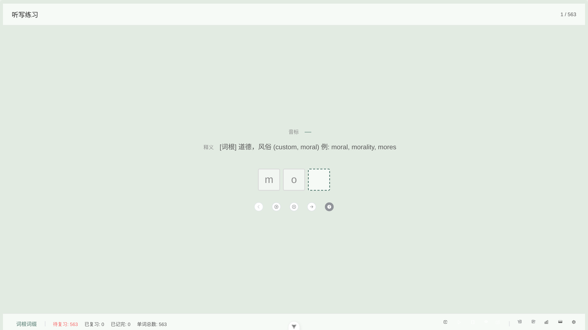

### 功能说明

听写模式通过播放单词发音，让用户拼写单词，检验听力与拼写能力。

### 使用方法

1. 在单词列表界面，点击"**听写模式**"按钮
2. 系统开始播放单词发音
3. 用户根据发音输入单词
4. 输入完成后回车确认，查看结果

### 听写设置

- **范围选择**：可选择全部单词、待复习单词、指定等级单词
- **播放次数**：设置每个单词发音播放次数
- **自动下一题**：答对后自动播放下一题
- **保存进度**：自动保存听写进度，下次可从上次位置继续

---

## 专注模式


### 功能说明

专注模式提供一个极简的悬浮窗口，让用户在工作学习间隙快速复习单词。支持多种复习模式（标准/拼写/听写）。

### 进入方式

在单词列表界面，点击"**专注模式**"按钮，或从听写练习页面跳转。

### 功能特性

| 功能 | 说明 |
|------|------|
| **置顶显示** | 窗口始终保持在最前 |
| **贴边隐藏** | 贴边时自动隐藏，鼠标靠近时展开 |
| **透明度调节** | 可调节窗口透明度（30%-100%） |
| **锁定模式** | 锁定后内容区鼠标穿透，仅顶部按钮可点击 |
| **拼写模式** | 键盘逐个字母拼写单词 |
| **听写模式** | 根据发音输入单词拼写 |
| **样式自定义** | 可设置字体颜色、单词字号、释义字号、背景图片 |

### 样式设置

在设置抽屉的"**专注模式设置**"区域，可自定义：

| 设置项 | 范围 | 说明 |
|--------|------|------|
| **字体颜色** | 任意色 / 跟随主题 | 单词和释义的文字颜色 |
| **单词字号** | 14-40 px | 单词主体的字号 |
| **释义字号** | 9-24 px | 中文释义的字号 |
| **背景图片** | 图片文件（≤2MB） | 窗口背景图片，data URL 持久化 |
| **背景透明度** | 0-100% | 背景图片的叠加透明度 |

> 修改后实时生效，无需关闭专注窗口。背景图不会覆盖透明度背景，贴边隐藏时自动隐藏。

### 专注模式快捷键

| 快捷键 | 功能 |
|--------|------|
| `Shift + R` | 认识（升级） |
| `Shift + F` | 忘记（降级） |
| `Shift + P` | 播放发音 |
| `Shift + T` | 显示/隐藏释义 |
| `↓` | 永久记住 |
| `←` | 上一个单词 |
| `→` | 下一个单词 |
| `Ctrl + L` | 锁定/解锁（鼠标穿透） |
| `Esc` | 关闭专注窗口 |

#### 文本专注模式快捷键

文本记忆页文章菜单「专注显示」打开的文本滚动浮窗，快捷键如下：

| 快捷键 | 功能 |
|--------|------|
| `空格` | 播放/暂停 |
| `←` / `→` | 后退 / 前进（小幅滚动正文） |
| `↑` / `↓` | 减速 / 加速 |
| `[` / `]` | 上一篇 / 下一篇 |
| `H` | 显示/隐藏标题 |
| `Ctrl + L` | 锁定/解锁（鼠标穿透） |
| `Ctrl + 滚轮` | 窗口透明度 |
| 滚轮 | 后退 / 前进 |
| `Esc` | 关闭专注窗口 |

---

## 音标学习

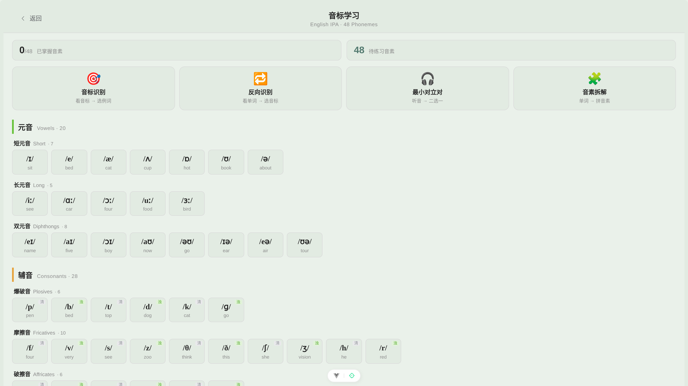

### 功能说明

提供各语言发音单元的系统学习和练习，支持四种训练模式。按当前词库语言自动切换数据集：英语 48 个国际音标、日语五十音（清音/浊音/拗音共 103 条）、俄语 33 个西里尔字母、西班牙语/法语发音精简集。学习进度按语言独立保存。

### 入口

单词页底部工具栏的「音标学习」图标按钮（🎤），进入 `/phonetic-memory` 路由。侧边栏无独立入口。

### 训练模式

| 模式 | 说明 |
|------|------|
| **音标识别** | 看音标 → 选例词（正向练习） |
| **反向识别** | 看单词 → 选音标（反向练习） |
| **最小对立对** | 听发音 → 二选一（辨别相似音） |
| **音素拆解** | 单词 → 拆解为各个音素 |

### 音标表

- 元音：单元音、双元音（共 20 个）
- 辅音：爆破音、摩擦音、破擦音、鼻音、半元音、舌侧音（共 28 个）
- 支持按分组查看、点击播放发音、跟踪掌握进度

---

## 字母映射记忆

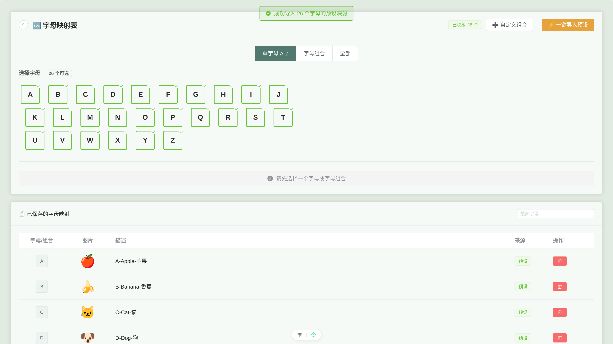

### 功能说明

通过字母与图像/关键词的关联（如 A=Apple 🍎）强化字母记忆，适合初学者和字母表盲打训练。字母表随当前词库语言切换：英语 26 字母（含联想预设）、日语假名、俄语西里尔字母、西班牙语（含 ñ）与法语字母。

### 入口

单词页底部工具栏的「字母映射」图标按钮（🎫），进入 `/letter-memory` 路由。侧边栏无独立入口。

### 使用方法

1. 选择单字母 A-Z 或字母组合
2. 为每个字母/组合关联图像（系统预设或自定义）
3. 支持一键导入预设映射表
4. 练习模式中根据提示回忆映射关系

---

## 数字记忆训练

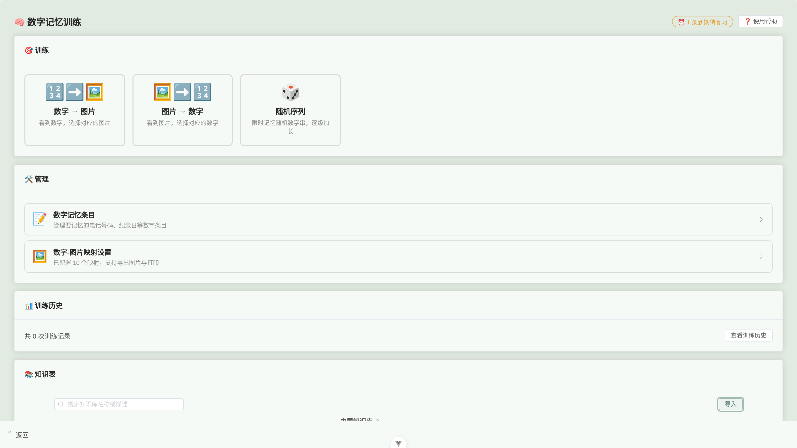

### 功能说明

数字记忆训练帮助你将 0-99 的每个数字关联到具体图像/关键词（如 15=鹦鹉、61=六一儿童节），利用图像编码法大幅提升长串数字的记忆效率。支持一键导入预设编码、映射表整图导出与打印，并提供条目管理与训练考核。

### 入口

侧边栏「数字记忆」或 `/number-memory` 路由。呼出 uTools 输入 `数字记忆` 也可进入。

### 功能模块

首页分为四个区域：

**① 训练**（三种训练模式）

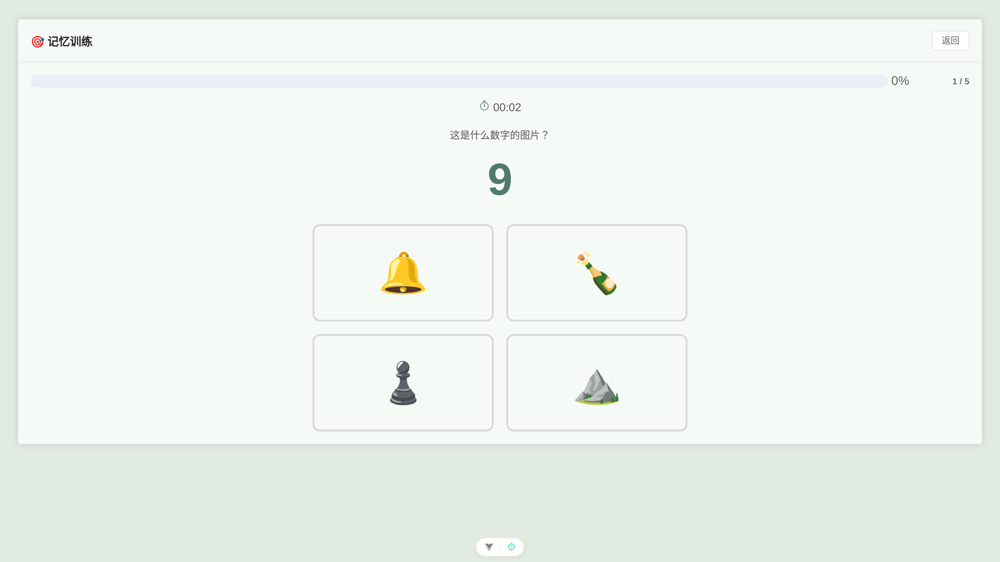

- **数字 → 图片**：看到数字，选择对应的关联图片
- **图片 → 数字**：看到图片，选择对应的数字
- **随机序列**：限时记忆随机数字串，逐级加长

> 前两种模式需先保存至少 4 个数字-图片关联；训练自动计时并统计正确率与用时，支持训练历史查看。

**② 管理**

- **数字记忆条目**：自由创建数字记忆条目（标题 + 数字 + 助记口诀 + 标签 + 描述），适合电话号码、纪念日等真实场景，支持搜索、标签筛选、到期复习与图片关联

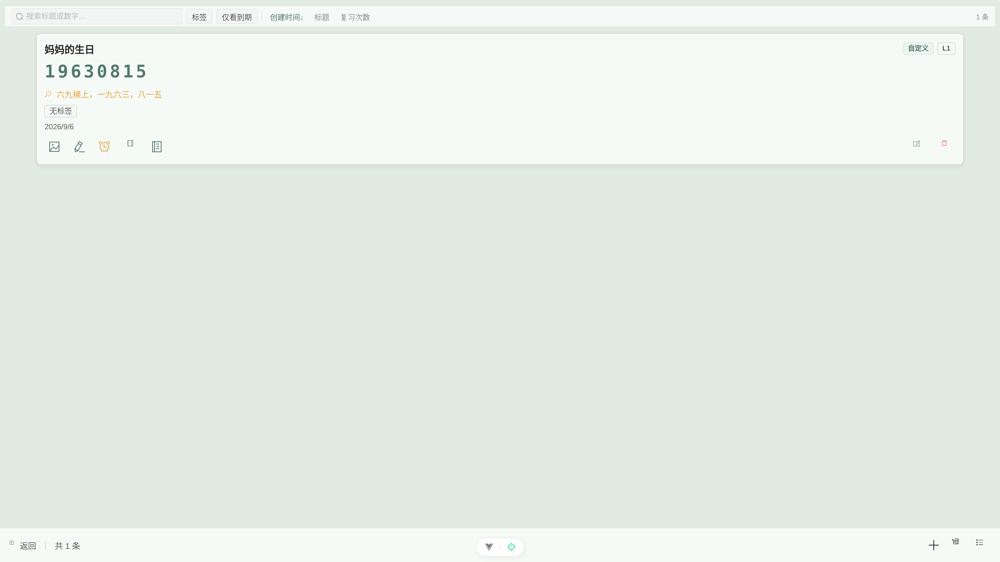

- **数字-图片映射设置**：按范围（个位数/前导零/两位数/全部 0-99）为每个数字选择预设图片或上传自定义图片，支持「一键导入预设」，并可将整张映射表导出为图片或打印

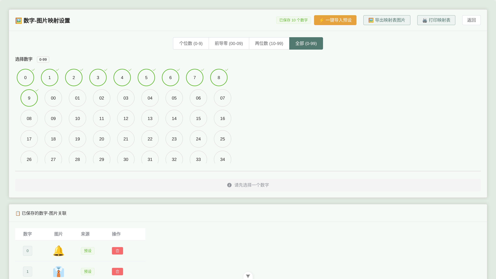

**③ 训练历史**：查看历史训练记录、正确率与用时。

**④ 知识表**：直接浏览/导入数学类知识包（乘法表、公式、元素周期表等），与「知识库」模块互通。

### 使用方法

1. 进入数字记忆页面，打开「数字-图片映射设置」
2. 点击「一键导入预设」批量导入 0-9 推荐图像，或逐个数字选择/上传关联图片
3. 至少关联 4 个数字后，回到首页点击「数字 → 图片」或「图片 → 数字」开始训练
4. 在「数字记忆条目」中记录电话号码、纪念日等需要记忆的数字
5. 查看训练报告与历史记录

### 适用场景

- 记忆长串电话号码、银行卡号
- 记忆圆周率、历史年份等数字序列
- 提升日常数字敏感度
- 锻炼图像联想能力

---

## 文本记忆

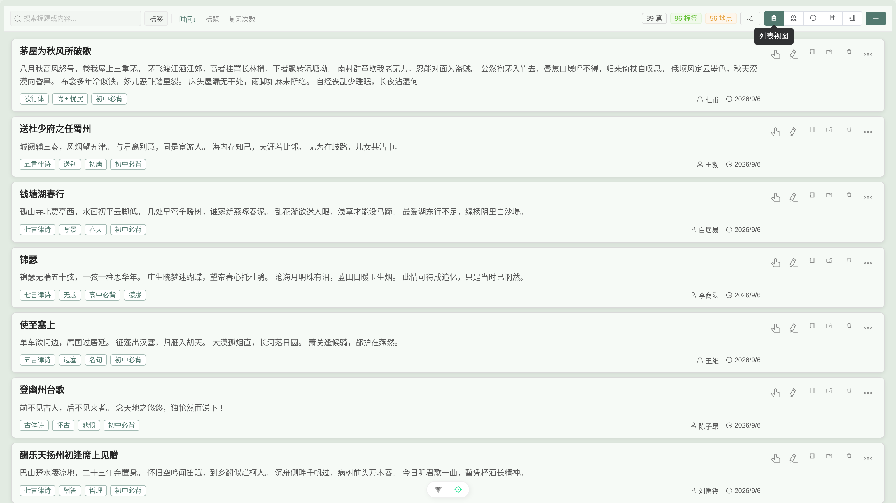

### 功能说明

文本记忆是**慢记工具的核心功能之一**，支持诗词、文章、知识点等任意长文本的导入、管理与多种记忆练习。页面顶部可在**列表 / 地图 / 时间线 / 记忆宫殿 / 知识库**五个视图间切换，支持按标签分类、按作者检索、地理地图标记。

### 入口

侧边栏「文本记忆」或 `/text-memory` 路由。呼出 uTools 输入 `文本记忆`、`诗词记忆` 或 `wbjy` 也可进入。

### 功能模块

**① 文章管理（列表视图）**
- 每篇文章显示标题、作者、摘要、标签与复习次数
- 支持搜索标题/内容、按标签筛选、按时间/标题/复习次数排序
- 卡片操作：跟打练习、填空练习、笔记、编辑、删除，更多菜单含地图定位与提示词

**② 地图视图（诗词地图）**

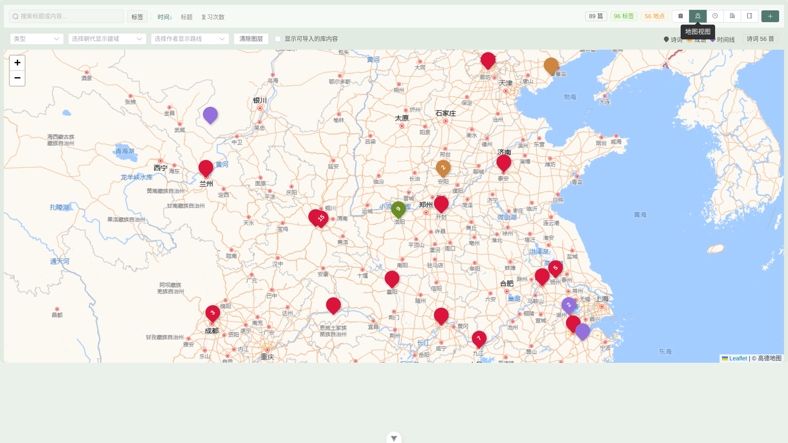

- 在地图上浏览所有已标记地点的文章（诗词/成语/时间线事件分层显示）
- 支持按类型、朝代、作者筛选路线，可直接在地图上勾选导入库内内容

**③ 时间线视图**

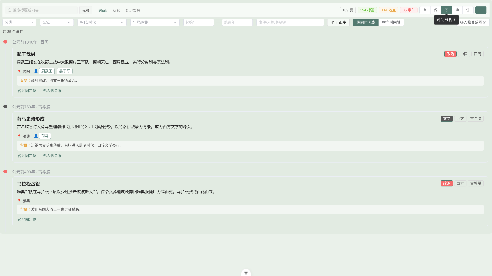

- 内置历史时间线事件按年代排列，支持分类/区域/朝代/年号/年份区间/关键词多维筛选
- 纵向时间线与横向时间轴两种展示，事件可地图定位、查看人物关系图谱

**④ 添加与导入**

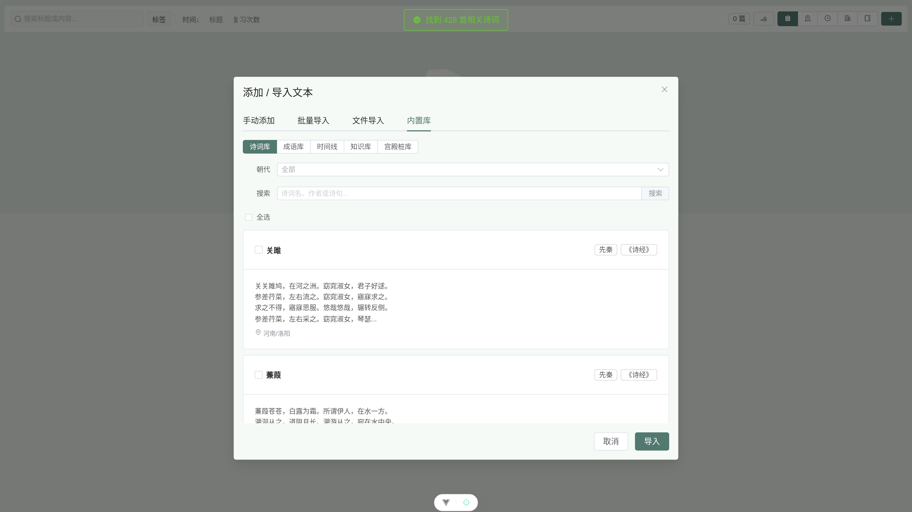

点击右上角「+」打开统一的「添加 / 导入文本」对话框，四个页签：

| 页签 | 说明 |
|------|------|
| **手动添加** | 输入标题、作者、正文内容 |
| **批量导入** | 粘贴批量文本，自动按章节/段落拆分 |
| **文件导入** | 导入 TXT/JSON 文件 |
| **内置库** | 开箱即用的内置内容库（默认选中），支持搜索与朝代筛选 |

**⑤ 内置库**（开箱即用，无需手动录入）

| 分类 | 规模 | 说明 |
|------|------|------|
| **诗词库** | 428 首 | 覆盖先秦至清各朝代，含原文/作者/朝代/创作地点/译注赏析 |
| **成语库** | 160 条 | 含拼音/释义/出处/典故/例句/地域/分类 |
| **时间线** | 336 事件 | 中西方历史事件，按朝代/世纪/领域分类，支持 AI 生成补充 |
| **知识库** | 知识包 | 与「知识库」模块互通的 text 类知识包 |
| **宫殿桩库** | 桩库 | 可导入记忆宫殿生成桩位的知识包（节气/生肖/数字桩等） |

> 内置库在「文本记忆」导入界面一键导入，导入后可与自建文章混合复习，自动去重。

**⑥ 练习模式**

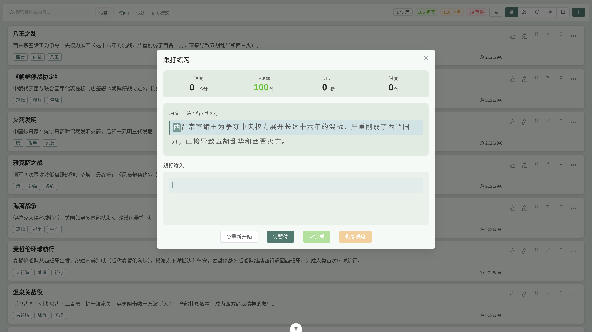

- **跟打练习**：按原文逐字输入，实时统计速度、正确率、用时与进度，支持暂停与断点恢复

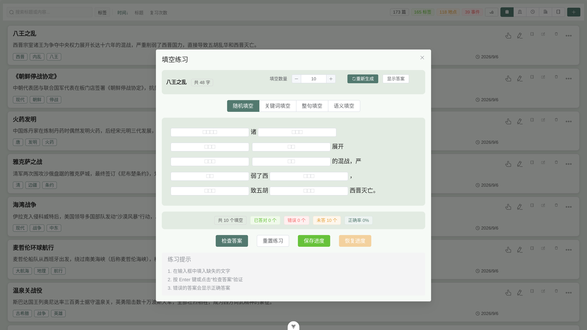

- **填空练习**：自动挖空关键词，支持**随机填空 / 关键词填空 / 整句填空 / 语义填空**四种策略，填空数量可调，可保存/恢复练习进度

**⑦ 辅助功能**

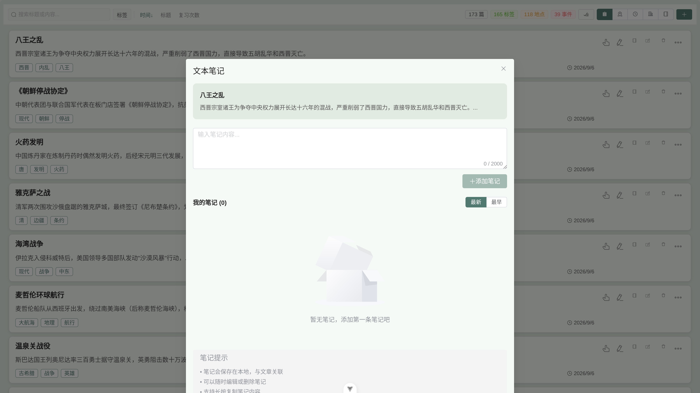

- **笔记**：为每篇文章添加个人学习笔记（心得）

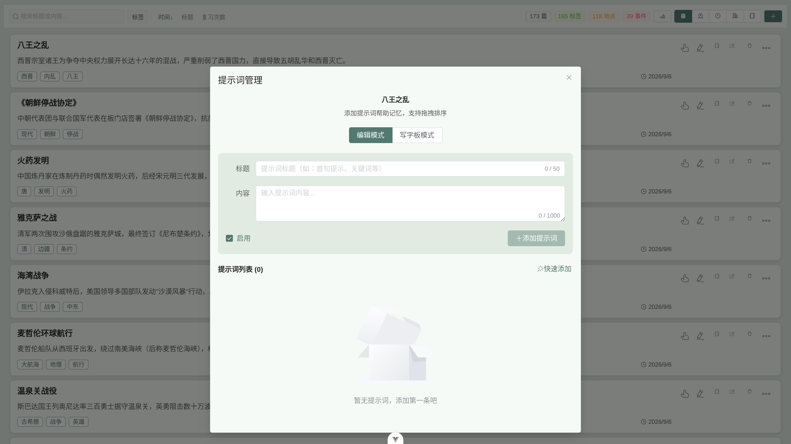

- **提示词**：自定义记忆提示词（如首句提示、关键词），支持编辑模式与写字板模式，帮助回忆关键内容
- **地图定位**：文章关联地理坐标时可在地图上标注
- **专注显示**：悬浮滚动播放窗口（仅 uTools / Electron 桌面端）

### 使用方法

1. 点击右上角「+」打开添加/导入对话框，手动添加或在内置库中勾选导入
2. 在列表视图点击文章卡片上的图标选择练习模式
3. **填空练习**：系统自动挖空，你根据上下文填写；**跟打练习**：对照原文打字
4. 系统自动记录复习次数，跟踪掌握进度

### 适用场景

- 古诗词背诵（如唐诗三百首）
- 英语范文/演讲稿记忆
- 专业课知识点背诵
- 国学经典、文言文学习
- 法律条文、合同条款记忆

---

## 记忆宫殿

### 功能说明

记忆宫殿（轨迹法）将需要记忆的内容与熟悉空间中的固定位置（"桩"）绑定，是公认最高效的记忆法之一。慢记工具内置桩库导入、桩位编辑、桩图配图与按桩回忆四件套，零基础也能快速搭建自己的宫殿。

### 入口

文本记忆页（侧边栏「文本记忆」）顶部的视图切换标签 →「记忆宫殿」（`/text-memory?view=palace`）。侧边栏没有独立的记忆宫殿入口。

从宫殿列表可进入三个子页面：详情 `/memory-palace/:id`、编辑 `/memory-palace/edit/:id`、巡视 `/memory-palace/:id/review`。

### 功能模块

**① 宫殿列表**（MemoryPalace）


- 管理多个独立宫殿（如「家居路线」「学校教室」）
- 每个宫殿显示桩位数、创建时间、复习进度
- 支持新建、编辑、删除、进入复习

**② 桩库导入**（内置桩库 → 一键转桩）
- 内置桩库（usableAsPeg 知识包）：数字桩、家居路线桩、二十四节气、十二生肖、身体桩、十二地支、房间桩、中国历代王朝等
- 导入时自动按条目顺序生成桩位，并把条目配图（emoji）转成桩图 dataURL
- 也支持手动逐个添加桩位

**③ 桩位编辑**（编辑页）

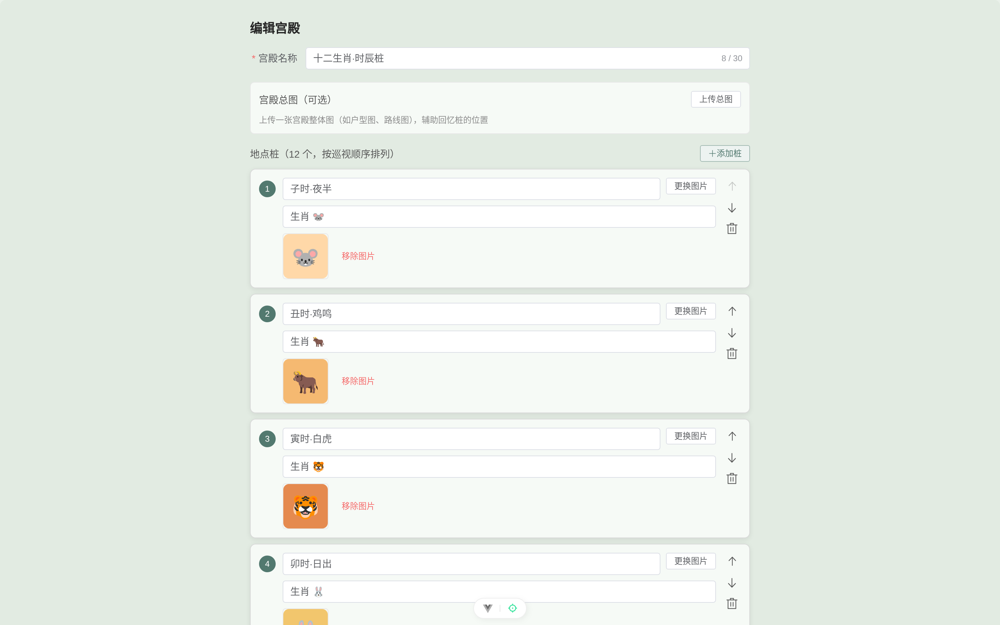

- 拖拽排序、增删桩位、为每个桩上传/替换图片
- 桩图支持 emoji 默认图与自定义照片（自动压缩为 dataURL 持久化）

**④ 宫殿详情**（详情页）

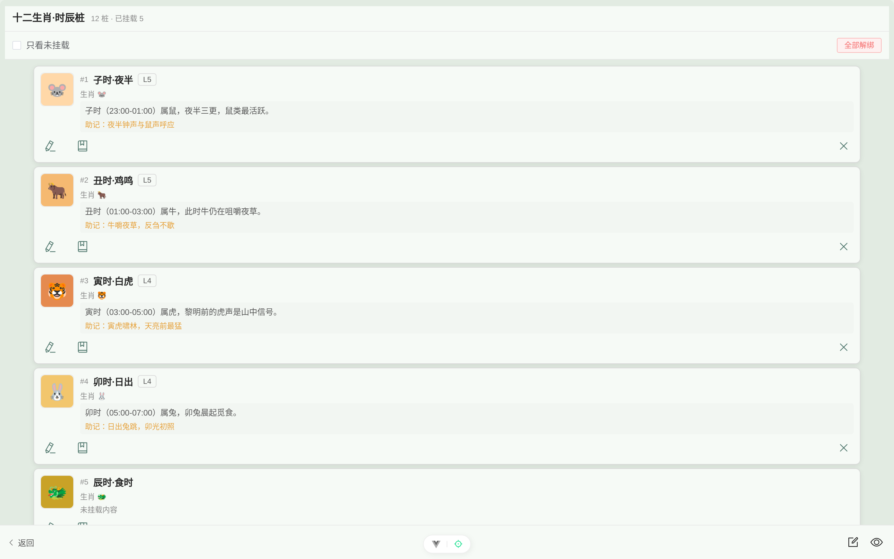

- 桩图网格预览、桩位列表
- 批量解绑桩图、单桩重置
- 进入复习

**⑤ 按桩回忆**（复习页）

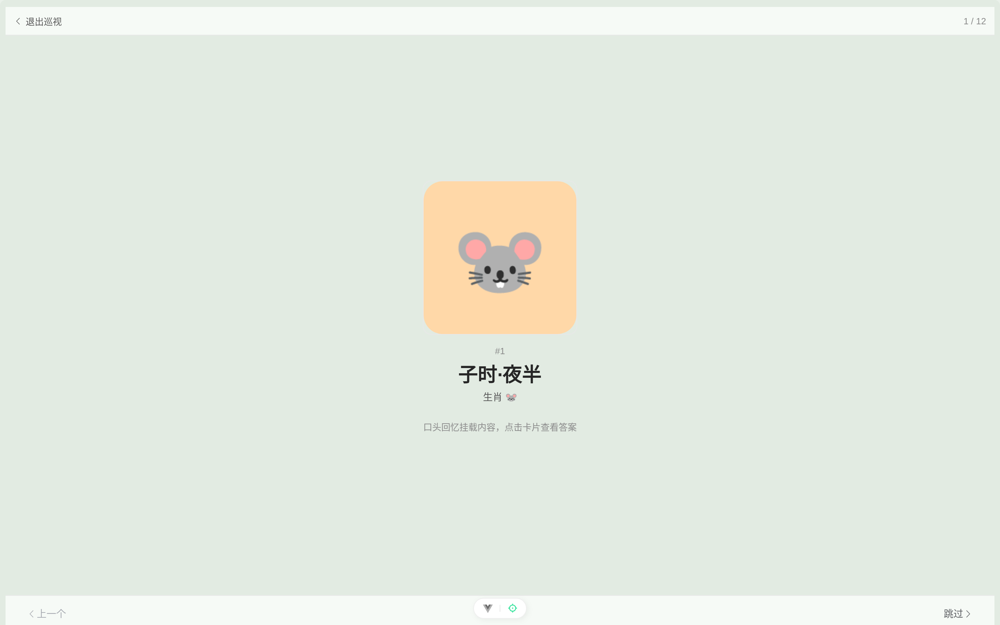

- 按桩位顺序逐个回忆关联内容
- 正向/反向回忆、自动计时与正确率统计

### 使用方法

1. 在宫殿列表点击「新建」，输入名称
2. 编辑页选择「导入桩库」→ 选内置桩库（如家居路线桩）→ 自动生成 12 个带默认图的桩位
3. 可逐个替换桩图为真实场景照片，加深空间记忆
4. 返回详情页，点击「开始复习」按桩位回忆

### 适用场景

- 背诵长篇演讲稿（每个桩挂一段）
- 记忆历史朝代顺序、二十四节气顺序
- 应试知识点的空间编码（医学/法考/考研）

---

## 知识库

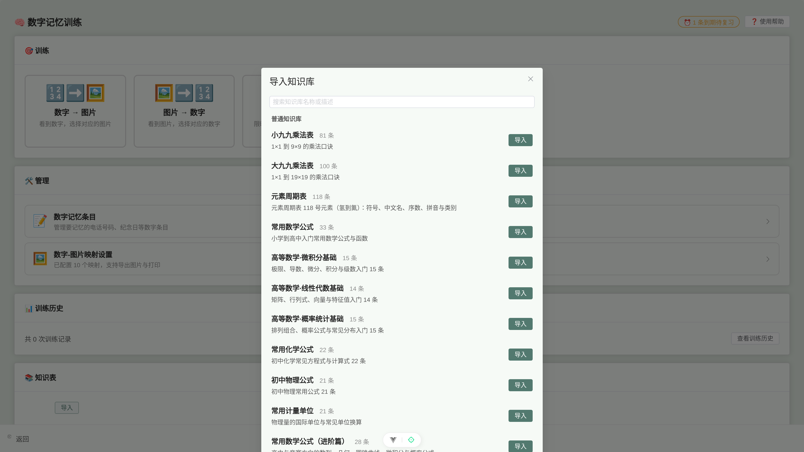

### 功能说明

知识库提供结构化的知识点包（题/答配对 + 附加标签 + 口诀），支持翻卡、反向、四选一、输入、顺序回忆五种练习模式。内置 36 个知识包覆盖数学、理科、文科常识；公式类条目支持**函数图像**交互演示，化学方程式条目支持**现象动画**播放，全部知识包支持打印与存图。

### 入口

知识包按分类自动归入宿主模块：**math 类**进入数字记忆页的「知识表」区域，**text 类**进入文本记忆页顶部视图切换的「知识库」标签。点击卡片进入 `/knowledge-memory/:id` 预览/练习页。

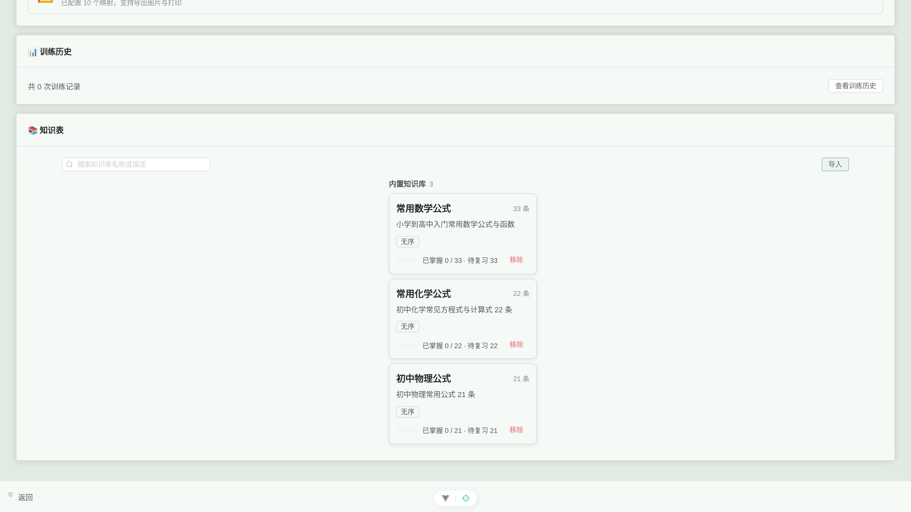

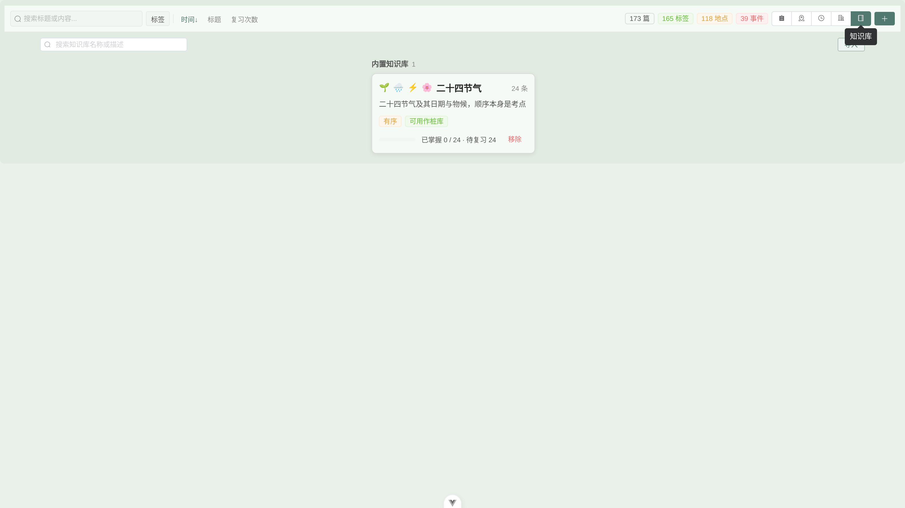

### 内置知识包（36 个）

| 分类 | 知识包 |
|------|--------|
| **数学**（数字记忆页） | 小九九/大九九乘法表、元素周期表（118 号）、常用数学公式（基础+进阶）、高等数学·微积分/线性代数/概率统计基础、常用计量单位、平方立方与幂次、100 以内质数表 |
| **理化生地**（数字记忆页） | 初中物理公式、常用化学公式 |
| **文科常识**（文本记忆页） | 二十四节气、十二生肖、十二星座、十二地支、十二种颜色、十二平均律、五十六个民族、八大菜系、中国省级行政区及省会、三十六计、世界国家与首都 |
| **初中学科**（文本记忆页） | 初中物理定律与原理、初中物理实验、初中生物实验、初中地理核心概念 |
| **桩库**（可导入宫殿） | 数字桩（1-12）、家居路线桩、身体桩、房间桩、字母形象桩（A-Z）、扑克牌桩（52 张）、中国历代王朝、二十四节气、十二生肖、十二地支 |

> 知识包持续扩充；桩库类包可一键导入记忆宫殿生成带默认图的桩位。

### 练习模式

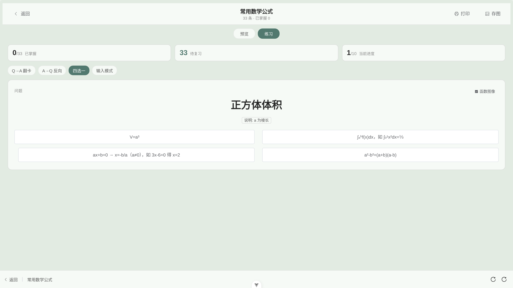

| 模式 | 说明 |
|------|------|
| **Q→A 翻卡** | 正面看题、翻面看答，逐条过卡 |
| **A→Q 反向** | 看答案回忆题目 |
| **四选一** | 题目 + 四个选项，选对升级、选错降级 |
| **输入模式** | 手动输入答案，严格校验拼写 |
| **顺序回忆** | 按序号回忆答案（仅有序知识包提供，如朝代、节气） |

练习页顶部展示已掌握/待复习/当前进度，按艾宾浩斯曲线自动安排复习。

### 函数图像与现象动画

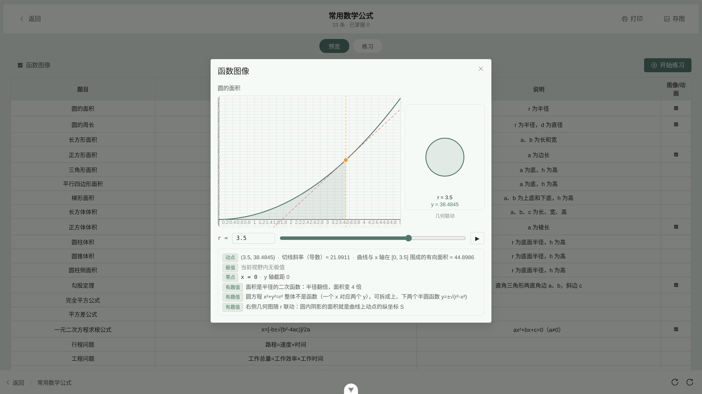

- **函数图像**：数学与物理公式条目可绘制交互函数曲线，支持滑动条改变参数、几何图形联动、动点/极值/零点/有趣值注解（如圆的面积 S=πr² 随半径联动画圆）
- **现象动画**：化学方程式条目内置粒子动画演示反应现象（如氢气燃烧的淡蓝色火焰），配现象文字说明

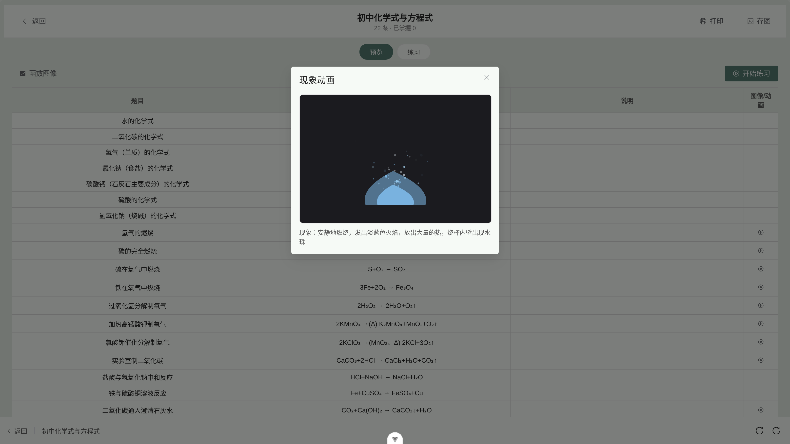

### 知识包预览

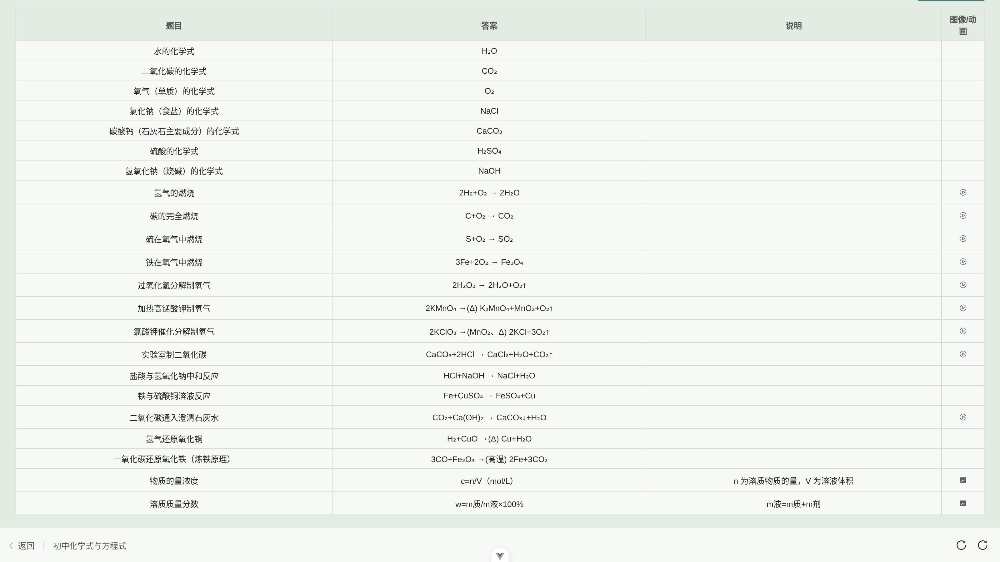

每个知识包提供预览表（题目/答案/说明列）与口诀块，支持配图（emoji 大字渲染）与「图像/动画」列快捷入口；整包可打印、可导出长图。

### 使用方法

1. 文本记忆/数字记忆页打开知识库面板，搜索或按分组浏览知识包
2. 点击「导入」（已导入的包显示进度与移除按钮）
3. 点击卡片进入练习页，在预览/练习间切换，选模式开始练习
4. 进度按艾宾浩斯曲线自动安排复习

### 适用场景

- 系统背诵元素周期表、乘法口诀
- 初中理科公式定律速记（配合函数图像与现象动画理解）
- 文科常识（朝代/民族/节气/生肖）顺序记忆
- 知识点转为桩库，配合记忆宫殿使用

---

## 快捷键记忆

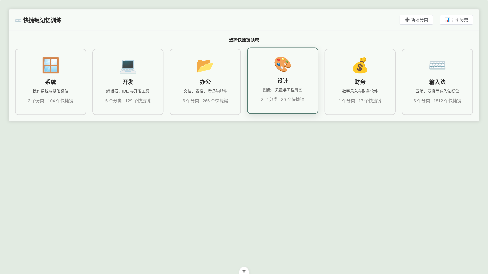

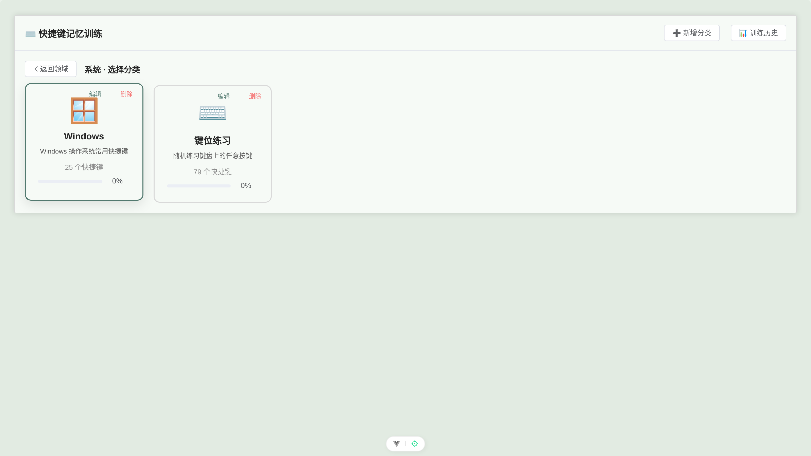

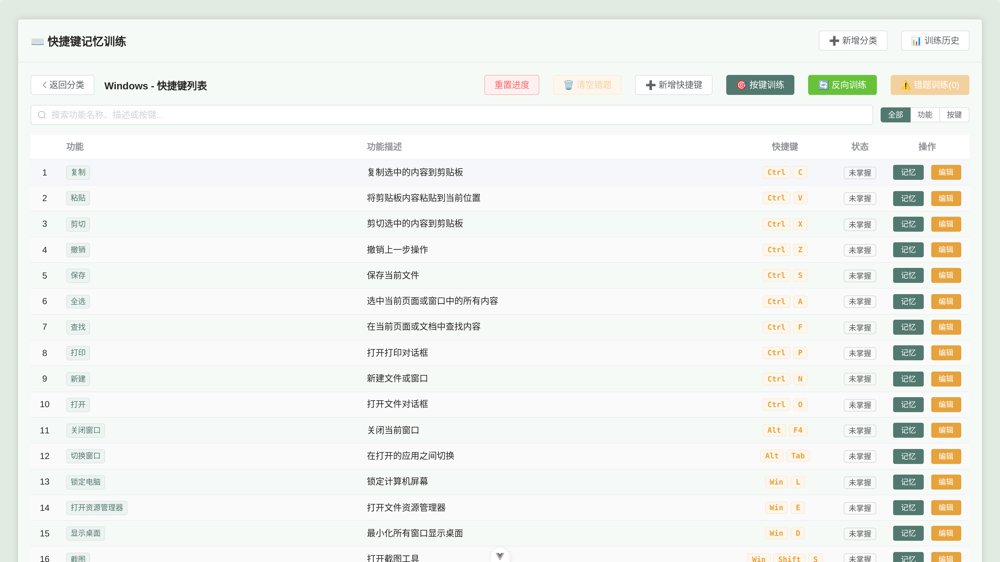

### 功能说明

快捷键记忆帮助用户快速掌握常用软件的快捷键操作，并支持五笔、双拼等输入法的键位与编码练习。提供按键训练、反向训练、错题训练三种模式，配合专项标签筛选与学习进度追踪。

### 入口

侧边栏「快捷键记忆」或 `/shortcut-memory` 路由（仅桌面环境）。

### 使用方法

1. **选择领域**：先选择快捷键所属领域（系统、开发、办公、设计、财务、输入法）
2. **选择分类**：在领域下选择具体分类（如 VS Code、五笔86版、双拼 · 小鹤）
3. **筛选标签**（可选）：对支持专项标签的分类，按「类型 + 分区」两维组合筛选练习范围
4. **开始训练**：从快捷键列表发起训练，结束后查看正确率与用时

### 训练模式

| 模式 | 说明 |
|------|------|
| **🎯 按键训练** | 显示功能名称，按下对应快捷键；组合键（Ctrl+C）同时按、顺序键（五笔/双拼编码）逐键顺序输入 |
| **🔄 反向训练** | 显示快捷键组合，从选项中选择对应的功能描述 |
| **⚠️ 错题训练** | 针对该分类下答错的条目专项重练 |

> 训练中点击「返回」会回到查看页并**保留**之前选定的领域、分类与标签筛选，无需重新选择。

### 专项标签筛选

部分分类（五笔、双拼）的条目带有专项标签，可在查看列表与训练中按需筛选：

- **类型**：字根、一级简码、二级简码、常用字、一级词组、二级词组、成语、键名字、万能键
- **分区**（五笔字根按首笔划分）：横区、竖区、撇区、捺区、折区

两维可组合使用，例如「一级简码 + 横区」只练横区的高频单键字。其中：

| 类型标签 | 说明 |
|----------|------|
| **一级简码** | 五笔高频单键字（1 键 + 空格），难度最低 |
| **二级简码** | 五笔两键简码字（2 键 + 空格） |
| **常用字** | 高频常用字（含一、二级简码） |
| **一级词组 / 二级词组** | 词组按常见度拆分两级，便于分级练习 |
| **字根** | 五笔字根（按键位分区） |
| **键名字** | 五笔键名字根 |
| **成语** | 四字成语编码 |

### 输入法练习

五笔（86/98 版）与双拼（小鹤、自然码、微软、搜狗）分类除键位/字根外，还运行时生成常用字、词组、一级简码等编码练习条目。输入法分类额外提供「🔤 悬浮键盘」按钮，可调出键位映射悬浮窗辅助对照（仅 uTools 桌面端）。

### 支持分类

| 领域 | 分类 |
|------|------|
| **系统** | Windows、键位练习、数字小键盘练习 |
| **开发** | VS Code、Chrome、IntelliJ IDEA、Vim、Claude Code CLI |
| **办公** | Word、Excel、PowerPoint、Outlook、Obsidian、思源笔记 |
| **设计** | Photoshop、Illustrator、CAD |
| **财务** | 数字小键盘练习 |
| **输入法** | 五笔86版、五笔98版、双拼 · 小鹤、双拼 · 自然码、双拼 · 微软、双拼 · 搜狗 |
| **自定义** | 用户自建分类 |

> 支持新增自定义分类与快捷键；内置分类可隐藏，自定义分类可编辑/删除/重命名。

---

## 记忆测试

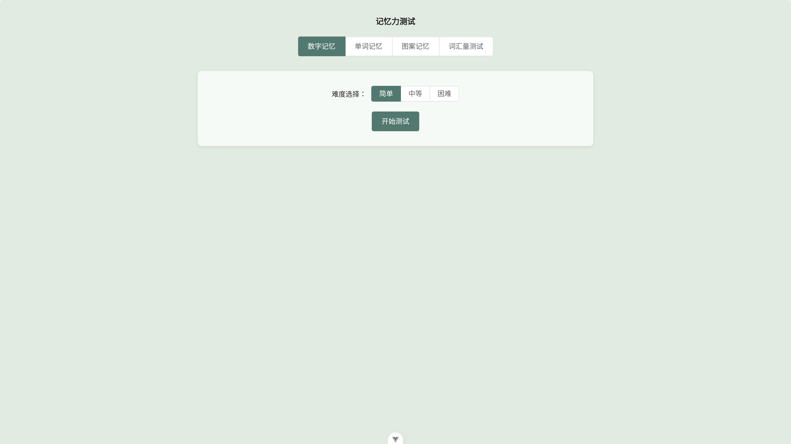

### 功能说明

记忆测试提供多种模式来评估和锻炼记忆力，包括数字记忆、单词记忆、图案记忆和词汇量测试四种模式。

### 入口

侧边栏「记忆测试」入口，或呼出 uTools 输入 `记忆测试`。

### 测试模式

| 模式 | 说明 |
|------|------|
| **数字记忆** | 显示一串数字后消失，凭记忆输入。支持简单（4位）、中等（6位）、困难（8位）三级难度，多轮递进 |
| **单词记忆** | 显示一组单词后消失，凭记忆列出。按轮次增加单词数量，测试短期词汇记忆能力 |
| **图案记忆** | 在网格中亮起若干格子后复原，按轮次增加格子数量，测试空间记忆能力 |
| **词汇量测试** | 按当前语言选择等级阶梯：英语 CET-4/6、雅思、托福、GRE；日语 JLPT N5~N1；俄/西/法 CEFR A1~C2 |

### 使用方法

1. 选择测试模式（数字/单词/图案/词汇量）
2. 选择难度级别
3. 点击"开始测试"
4. 按提示完成各轮测试
5. 查看测试结果报告

### 词汇量测试

词汇量测试是独立子模块，通过多级抽样准确估算词汇量：

| 功能 | 说明 |
|------|------|
| **测试轮数** | 可选快速（3轮/约5分钟）、标准（5轮/约8分钟）、精确（7轮/约12分钟） |
| **每轮词数** | 每轮 5-15 个单词可调 |
| **智能分级** | 基于多级词库（CET4→CET6→考研→雅思→托福→GRE）逐步提升难度 |
| **结果分析** | 预估总词汇量、各等级掌握情况、阅读水平评估 |
| **历史记录** | 保存每次测试结果，展示词汇量变化趋势图 |
| **阅读推荐** | 根据测试结果推荐适合当前词汇量的阅读材料 |

---

## 快速翻译

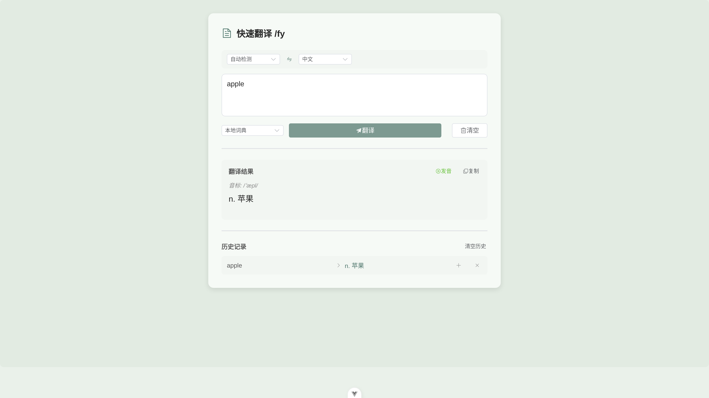

### 功能说明

快速翻译是一个功能完整的翻译工具，支持多种翻译引擎、语种切换、粘贴图片 OCR 翻译、记忆联想、近反义词与例句展示。

### 入口

侧边栏「快速翻译」或 `/translate` 路由。呼出 uTools 输入 `翻译` 或 `fy` 也可直接进入。

### 使用方法

1. 在输入框中输入要翻译的文本
2. 选择源语言和目标语言（支持互换）
3. 选择翻译引擎后点击「翻译」或按 Enter
4. 查看翻译结果（音标/释义/发音/复制），历史记录可一键加入单词簿

### 特色功能

| 功能 | 说明 |
|------|------|
| **语言互换** | 一键交换源语言和目标语言 |
| **粘贴图片 OCR** | 输入框支持粘贴图片，自动 OCR 识别后翻译 |
| **记忆联想** | AI 引擎返回结果时附带记忆技巧与 Emoji 视觉联想 |
| **近义词/反义词** | 展示单词的近义词与反义词，辅助扩展词汇 |
| **例句展示** | 提供典型例句，理解单词在上下文中的用法 |
| **发音播放** | 点击发音按钮播放单词美式发音 |
| **结果复制** | 一键复制翻译结果到剪贴板 |

### 翻译引擎

可在设置中切换以下翻译引擎：

| 引擎 | 类型 | 是否需要密钥 | 说明 |
|------|------|-------------|------|
| 有道翻译 | 传统 | 是 | 稳定可靠的翻译服务 |
| 百度翻译 | 传统 | 是 | 支持多种语言互译 |
| 阿里云翻译 | 传统 | 是 | 专业机器翻译服务 |
| 腾讯翻译 | 传统 | 是 | 腾讯云翻译服务 |
| DeepSeek | AI | 是 | 深度求索大模型 |
| Kimi (Moonshot) | AI | 是 | 月之暗面大模型 |
| 通义千问 | AI | 是 | 阿里云大模型 |
| 智谱 GLM | AI | 是 | 智谱 AI 大模型（默认引擎，有免费额度） |
| MiniMax | AI | 是 | MiniMax 大模型 |
| 腾讯混元 | AI | 是 | 腾讯混元大模型 |
| uTools AI | AI | 否 | uTools 内置 AI 翻译 |
| Ollama | 本地 | 否 | 本地运行大模型 |
| 本地词典 | 本地 | 否 | 无需网络，即查即用 |

> **提示**：AI 翻译引擎支持更自然的语言理解和上下文翻译，推荐配置个人密钥使用。

---

## 词库管理

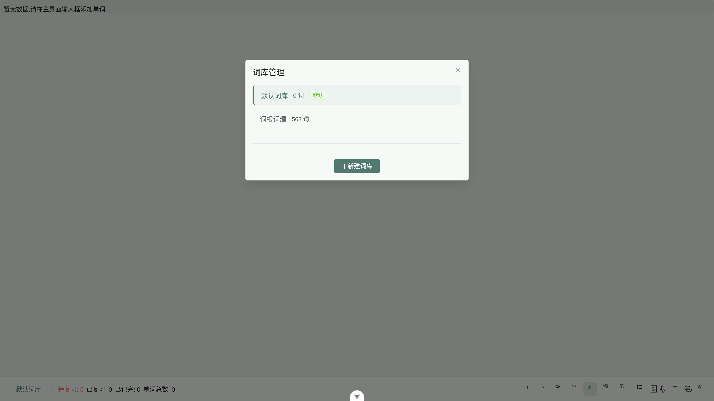

### 内置词库

系统内置以下权威词库：

#### 英语考试词库
- **大学英语四级词汇**（CET-4）
- **大学英语六级词汇**（CET-6）
- **英语专业四级词汇**（TEM-4）
- **英语专业八级词汇**（TEM-8）
- **考研英语词汇**
- **托福词汇**（TOEFL）
- **雅思词汇**（IELTS）
- **GRE 词汇**
- **GMAT 词汇**
- **商务英语词汇**（BEC）
- **SAT 词汇**
- **考公词汇**
- **专升本词汇**

#### 专项词库
- **词根词缀**
- **短语动词**
- **固定搭配**
- **习语**

### 切换词库

1. 进入单词列表界面，点击底部左下角"**当前词库名**"
2. 在弹出的词库管理器中点击需要学习的词库即可切换
3. 每个词库独立存储单词与复习进度

### 自定义词库

1. 在词库管理器中点击"**新建词库**"
2. 初始内容可选**空词库**或**从系统词库导入**（在弹出的列表中选择任一内置词库）
3. 词库数据独立存储，可随时切换、删除

---

## 设置与配置

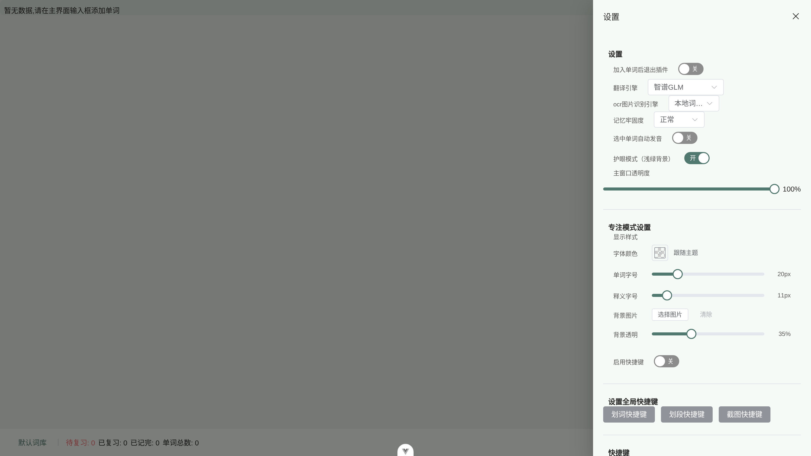

### 打开设置

在单词列表界面，点击右上角的"**设置**"图标。

### 设置项说明

#### 1. 常规设置

| 设置项 | 说明 |
|--------|------|
| **加入单词后退出插件** | 添加单词后自动关闭 uTools 插件 |
| **翻译引擎** | 选择默认翻译引擎 |
| **OCR 引擎** | 选择截图识别的 OCR 引擎 |
| **记忆牢固度** | 正常 / 较强 / 极强（影响复习间隔） |
| **选中单词自动发音** | 在单词列表中点击单词时自动播放发音 |
| **护眼模式** | 浅绿护眼背景开关（浅色主题下生效） |
| **主窗口透明度** | Web/Electron 环境下主窗口透明度（30%-100%） |
| **启用快捷键** | 启用/禁用插件内快捷键 |

#### 2. 专注模式设置

| 设置项 | 说明 |
|--------|------|
| **字体颜色** | 自定义单词和释义文字颜色 |
| **单词字号** | 专注模式单词字号（14-40px） |
| **释义字号** | 专注模式释义字号（9-24px） |
| **背景图片** | 选择/清除专注模式背景图片（≤2MB） |
| **背景透明度** | 背景图片叠加透明度（0-100%） |

#### 3. 全局快捷键

| 设置项 | 说明 |
|--------|------|
| **划词快捷键** | 设置划词添加的全局快捷键 |
| **划段快捷键** | 设置划段添加的全局快捷键 |
| **截图快捷键** | 设置截图添加的全局快捷键 |

#### 4. 密钥配置

配置各翻译引擎的 API 密钥，配置后可享受：
- 无限制使用次数
- 更稳定的翻译服务
- 支持更多高级功能

**支持的引擎密钥配置**：

| 引擎 | 是否需要密钥 | 特点 |
|------|-------------|------|
| 有道翻译 | 是 | 稳定可靠，新用户有免费额度 |
| 百度翻译 | 是 | 每月有免费额度 |
| 阿里云翻译 | 是 | 新用户有免费额度 |
| 腾讯翻译 | 是 | 腾讯云翻译服务 |
| DeepSeek | 是 | AI 翻译，效果自然 |
| Kimi (Moonshot) | 是 | AI 翻译，上下文理解好 |
| 通义千问 | 是 | 阿里云大模型 |
| 智谱 GLM | 是 | 有免费额度，性价比高 |
| MiniMax | 是 | MiniMax 大模型 |
| 腾讯混元 | 是 | 腾讯混元大模型 |

> **密钥申请指南**：详见附录《API 密钥申请教程》

#### 5. 配置导入导出

支持导出/导入配置文件（包含 API 密钥、翻译引擎设置、专注模式样式等个人配置）。

---

## 导入与导出


### 导出单词

1. 进入单词列表界面，点击底部工具栏的"**导出**"图标
2. 选择导出格式：**导出 JSON** / **导出 TXT**
3. 保存文件到本地

### 导入单词

1. 进入单词列表界面，点击底部工具栏的"**导入**"图标
2. 选择导入方式：**JSON 导入** / **TXT/CSV 导入** / **从词库导入**（内置词库）
3. 选择对应文件，系统自动解析并导入

### 文件格式说明

#### 格式一：简单格式（仅单词）

每行一个单词，系统会自动查询释义：

```
apple
banana
orange
computer
```

#### 格式二：完整格式（保留状态）

**JSON 格式**：

```json
[
  {
    "text": "apple",
    "explains": "n. 苹果",
    "phonetic": "[ˈæpl]",
    "level": 3,
    "isReview": true,
    "remember": false
  }
]
```

**TXT/CSV 格式**：

```
单词|释义|音标|等级|是否复习|是否记住
apple|n. 苹果|[ˈæpl]|3|true|false
```

---

## 多端同步

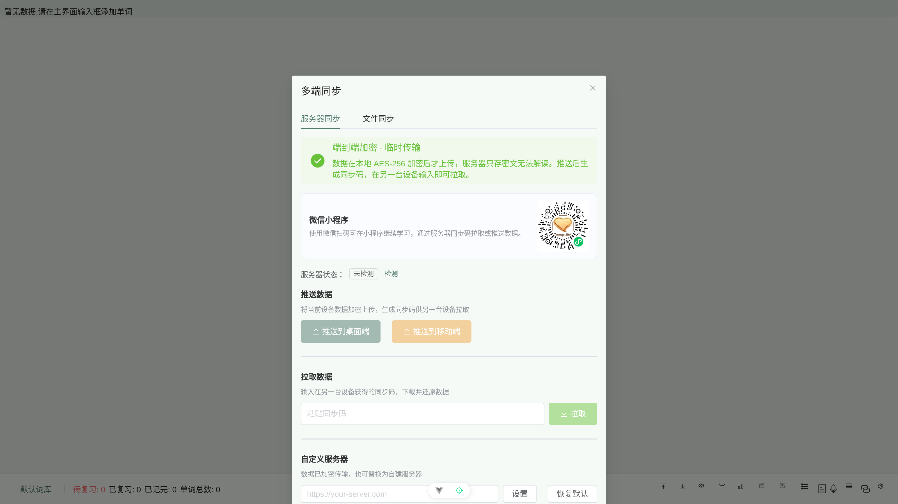

### 功能说明

支持跨设备数据同步。在单词列表界面点击底部工具栏的"**多端同步**"图标打开同步面板，包含两种方式：

**① 服务器同步（推荐）**

- **端到端加密**：数据在本地 AES-256 加密后才上传，服务器只存密文无法解读
- **推送数据**：将当前设备数据加密上传，生成一次性**同步码**
- **拉取数据**：在另一台设备输入同步码即可下载还原
- 可推送/拉取**桌面端**与**移动端**（微信小程序）数据；小程序可扫码直接进入
- 默认使用官方中转服务器，也可在「自定义服务器」中替换为自建服务器（可检测服务器状态）

**② 文件同步**

- 导出/导入数据文件，通过任意渠道传输完成同步，适合无服务器环境

### 同步内容

- 所有词库及单词数据
- 文本记忆、数字记忆、快捷键记忆、字母映射数据
- 用户设置（翻译引擎、记忆牢固度、专注模式配置等）

---

## 快捷键

### 全局快捷键（uTools 插件）

| 快捷键 | 功能 |
|--------|------|
| `Alt + 空格` | 呼出/隐藏 uTools |
| 自定义 | 划词添加（需在 uTools 设置中配置） |
| 自定义 | 划段添加（需在 uTools 设置中配置） |
| 自定义 | 截图添加（需在 uTools 设置中配置） |

### 调试快捷键

| 快捷键 | 功能 |
|--------|------|
| `Ctrl + Shift + D` | 打开/关闭调试面板 |

### 单词列表快捷键

| 快捷键 | 功能 |
|--------|------|
| `Shift + R` | 记得选中单词（升级） |
| `Shift + F` | 忘记选中单词（降级） |
| `Shift + P` | 选中单词发音 |
| `Shift + T` | 翻译选中单词 |
| `Ctrl + Enter` | 保存释义编辑 |

### 专注模式快捷键

| 快捷键 | 功能 |
|--------|------|
| `Shift + R` | 认识（升级） |
| `Shift + F` | 忘记（降级） |
| `Shift + P` | 播放发音 |
| `Shift + T` | 显示/隐藏释义 |
| `↓` | 永久记住 |
| `←` | 上一个单词 |
| `→` | 下一个单词 |
| `Ctrl + L` | 锁定/解锁（鼠标穿透） |
| `Esc` | 关闭专注窗口 |

### 听写模式快捷键

| 快捷键 | 功能 |
|--------|------|
| `Shift + H` | 显示提示（显示当前单词的首字母或长度） |
| `Shift + ←` | 上一个单词 |
| `Shift + →` | 跳过/下一个单词 |
| `Space` | 播放发音 |
| `Enter` | 跳过当前单词 |
| `Shift + F` | 标记忘记 |
| `Backspace` | 删除上一个输入的字符 |
| `Esc` | 退出听写模式（回到设置界面） |

### 拼写模式快捷键（专注模式内）

| 快捷键 | 功能 |
|--------|------|
| `A-Z` 字母键 | 逐个输入字母拼写单词 |
| `Escape` | 退出拼写模式 |
| `←` / `→` | 切换单词

---

## 常见问题

### Q1: 为什么截图翻译有次数限制？

截图翻译涉及 OCR 识别和翻译 API 调用，成本较高。未配置密钥时，每日限制 5-10 次。建议配置自己的 API 密钥，可享受免费额度。

### Q2: 如何离线使用？

在设置中选择"**本地词典**"作为翻译引擎，无需网络即可查词。但本地词典词汇量有限，建议配合在线引擎使用。

### Q3: 数据存储在哪里？

所有数据存储在本地数据库中，不会上传到云端。重装系统前请记得导出备份。

### Q4: 如何同步多台设备的数据？

在单词列表底部工具栏点击"**多端同步**"，推荐使用**服务器同步**：设备 A「推送数据」生成同步码，设备 B 输入同步码「拉取数据」即可完成（数据全程 AES-256 加密）。无服务器环境可使用**文件同步**：
1. 在设备 A 导出数据文件
2. 将文件传输到设备 B
3. 在设备 B 导入文件

### Q5: 为什么有些单词没有发音？

请检查：
1. 网络连接是否正常
2. 发音引擎设置是否正确
3. 是否启用了离线发音

### Q6: 如何更换主题？

插件自动适配 uTools 的主题设置。在 uTools 设置中切换浅色/深色主题，插件会自动跟随切换，支持暗黑模式。

### Q7: 添加单词后没有出现在列表中？

请检查：
1. 是否正确点击了"确认添加"
2. 列表筛选条件是否设置为"全部"
3. 是否开启了"只显示待复习"筛选

### Q8: 如何删除单词？

在单词列表中，点击单词卡片上的删除按钮。

### Q9: 如何切换词库？

在单词列表界面，点击底部"**当前词库名**"打开词库管理器，选择需要学习的词库。词库数据独立存储，切换后显示对应词库的单词。

### Q10: 听写模式如何保存进度？

听写模式会自动保存当前进度，下次进入时会询问是否继续上次的听写。也可在听写设置中关闭自动保存。

### Q11: 专注模式字体/背景设置为什么不生效？

请确认：
1. uTools 开发者工具的"资源目录"指向当前正确的项目 dist 目录
2. 修改设置后无需关闭专注窗口，设置实时生效
3. 如使用打包版本，需执行 `npm run build` 更新插件

---

## 附录：API 密钥申请教程

### 有道翻译

1. 访问 [有道智云](https://ai.youdao.com/)
2. 注册并登录账号
3. 创建应用，选择"文本翻译"服务
4. 获取应用 ID 和应用密钥

### 百度翻译

1. 访问 [百度翻译开放平台](https://api.fanyi.baidu.com/)
2. 注册成为开发者
3. 开通"通用文本翻译"服务
4. 在开发者信息中获取 APP ID 和密钥

### 阿里云翻译

1. 访问 [阿里云机器翻译](https://mt.console.aliyun.com/)
2. 开通翻译服务
3. 创建 AccessKey（建议使用子账号）
4. 为子账号添加"管理机器翻译权限"

### DeepSeek

1. 访问 [DeepSeek 平台](https://platform.deepseek.com/)
2. 注册并登录账号
3. 在 API 密钥页面创建密钥

### Kimi (Moonshot)

1. 访问 [Moonshot 平台](https://platform.moonshot.cn/)
2. 注册并登录账号
3. 在账户设置中获取 API 密钥

### 通义千问

1. 访问 [阿里云百炼](https://bailian.console.aliyun.com/)
2. 开通模型服务
3. 获取 API Key

### 智谱 GLM

1. 访问 [智谱 AI 开放平台](https://open.bigmodel.cn/)
2. 注册并登录账号
3. 在 API 密钥管理页面获取密钥

### MiniMax

1. 访问 [MiniMax 开放平台](https://platform.minimaxi.com/)
2. 注册并登录账号
3. 在账户管理页面创建 API Key

### 腾讯混元

1. 访问 [腾讯混元大模型](https://cloud.tencent.com/product/hunyuan)
2. 开通混元大模型服务
3. 在 API 密钥管理中获取密钥

---

## 版本更新记录

| 版本 | 更新日期 | 更新内容 |
|------|----------|----------|
| v1.1.17 | 2026.09 | 新增「记忆宫殿」模块（轨迹法：桩库导入/桩位编辑/桩图配图/按桩回忆，内置 8 套桩库）；新增「知识库」模块（26+ 内置知识包，翻卡/四选一/顺序回忆/输入四种练习模式，带预览配图）；文本记忆内置库扩充与清理（古诗词 428 首、成语 160 条、历史时间线 336 事件）；知识包条目支持 emoji 配图，桩库一键导入宫殿即带默认桩图 |
| v1.1.16 | 2026.09 | 文本记忆增强（时间线整理、地理关联、打字/填空/关键词记忆、悬浮滚动播放、心得笔记）；快捷键记忆细分（双拼/五笔/数字小键盘/系统与开发软件快捷键、双拼键位显示）；单词复习增强（单词筛选、删词、切换词库、单词拼写）；专注模式迷你悬浮窗；音标练习；字母图片映射；小程序多端同步 |
| v1.0.15 | 2026.08 | 快捷键记忆增强：训练支持专项标签筛选（类型+分区两维）、分类细分（一级简码/二级简码/一级词组/二级词组）、训练返回保留选择状态、五笔/双拼顺序输入与悬浮键盘、自定义分类管理 |
| v1.0.14 | 2026.06 | 新增专注模式样式自定义（字体颜色、字号、背景图）、方向下键永久记住、音标学习（四种训练模式）、字母映射记忆、词根词缀筛选强化 |
| v1.0.13 | 2026.06 | 新增多端数据同步、专注模式拼写+自动发音+同步复习、听写模式全面优化、快捷键完善（双拼/五笔字根）、字母表盲打修复、翻译记录管理、小程序打包优化 |
| v1.0.12 | 2026.04 | 新增词库切换、考研/托福/雅思/GRE/GMAT 词库、词根词缀颜色区分、快捷键记忆、听写模式优化 |
| v1.0.11 | 2026.03 | 新增听写功能、数字记忆、文本记忆、专注模式（置顶/贴边/透明度调节） |
| v1.0.10 | 2026.02 | 新增截图添加、划段添加、多引擎翻译（uTools AI、OpenAI、Gemini、Claude）、离线词典、暗黑主题适配 |
| v1.0.9 | 2026.01 | 新增设置页面、快捷键支持、划词全局快捷键、发音引擎选择 |
| v1.0.8 | 2025.11 | 新增导入导出、音频缓存、单词筛选功能、永久记住功能 |

---

## 技术支持

如遇到问题或有功能建议，欢迎通过以下方式反馈：

- **uTools 插件市场**：在插件详情页留言
- **GitHub Issues**：提交 Issue（如有开源仓库）

---

## 界面截图

### 导出文件格式示例

导出单词支持 JSON / TXT 两种格式，示例见下图：

**JSON 格式**（`words_export.json`）


**TXT 与 JSON 对照**（`words_export.txt` / `words_export.json`）


**TXT 格式**（`words_export.txt`）


### 翻译密钥申请示例

各翻译引擎的 API 密钥申请界面示例：

**阿里云机器翻译**（创建子账号并获取 AccessKey）


**百度翻译开放平台**（开通翻译服务）


**有道智云**（获取 APP ID 与密钥）


---

**祝您学习愉快，单词记忆事半功倍！**
